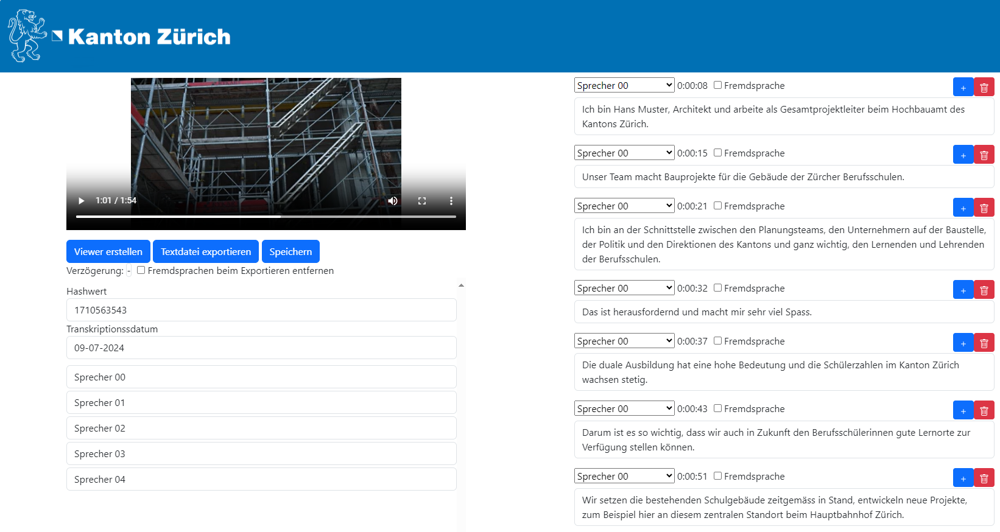

# Audio Transcription Tool "TranscriboZH"
**Transcribe any audio or video file. Edit and view your transcripts in a standalone HTML editor.**

[](https://github.com/machinelearningZH/audio-transcription)



<details>

<summary>Contents</summary>

- [Usage](#usage)
- [Project information](#project-information)
    - [What does the app do?](#what-does-the-app-do)
    - [Hardware requirements](#hardware-requirements)
- [Project team](#project-team)
- [Contributing](#feedback-and-contributing)

</details>

## Set up
### Installation
- Make sure you have a compatible NVIDIA driver and CUDA Version installed: https://pytorch.org/
- Install ffmpeg
    - Windows: https://phoenixnap.com/kb/ffmpeg-windows
    - Linux: `sudo apt install ffmpeg`
- Install conda
    - `mkdir -p ~/miniconda3`
    - `wget https://repo.anaconda.com/miniconda/Miniconda3-latest-Linux-x86_64.sh -O ~/miniconda3/miniconda.sh`
    - `bash ~/miniconda3/miniconda.sh`
    - `rm ~/miniconda3/miniconda.sh`
- Create a new Python environment, e.g.: `conda create --name transcribo python=3.10`
- Activate your new environment: `conda activate transcribo`
- Clone this repo.
- Install packages:
    - Check the installed cuda version: `nvcc --version`
    - Run the following command with your specific cuda version. This example is for cuda version 11.8, change this number if you have a different version installed.
    - `conda install pytorch==2.1.2 torchvision==0.16.2 torchaudio==2.1.2 pytorch-cuda=11.8 -c pytorch -c nvidia`
    - `pip install -r requirements.txt`
- Make sure, that the onnxruntime-gpu package is installed. Otherwise uninstall onnxruntime and install onnxruntime-gpu (if in doubt, just reinstall onnxruntime-gpu)
    - `pip uninstall onnxruntime`
    - `pip install --force-reinstall onnxruntime-gpu`
    - `pip install --force-reinstall -v "numpy==1.26.3"`
- Create a Huggingface access token
    - Accept [pyannote/segmentation-3.0](https://hf.co/pyannote/segmentation-3.0) user conditions
    - Accept [pyannote/speaker-diarization-3.0](https://huggingface.co/pyannote/speaker-diarization) user conditions
    - Create access token at [hf.co/settings/tokens](https://hf.co/settings/tokens) with read and write permissions.
- Create a `.env` file and input your access token:
```
    HF_AUTH_TOKEN = ...
```
### Run the application
Start the worker and frontend scripts:
- Linux
    - `tmux new -s transcribe_worker`
    - `conda activate transcribo`
    - `python worker.py`
    - `tmux new -s transcribe_frontend`
    - `conda activate transcribo`
    - `python main.py`
- Windows
    - See `run_gui.bat`, `run_transcribo.bat` and `run_worker.bat`

### Config
|   | Description |
|---|---|
| ONLINE | Boolean. If TRUE, exposes the frontend in your network. You must provide a SSL cert and key file. See the [nicegui](https://nicegui.io/documentation/section_configuration_deployment) documentation for more information |
| SSL_CERTFILE | String. The file path to the SSL cert file |
| SSL_KEYFILE | String. The file path to the SSL key file |
| STORAGE_SECRET | String. Secret key for cookie-based identification of users |
| ROOT | String. path to main.py and worker.py |
| WINDOWS | Boolean. Set TRUE if you are running this application on Windows. |
| DEVICE | String. 'cuda' if you are using a GPU. 'cpu' otherwise. |
| ADDITIONAL_SPEAKERS | Integer. Number of additional speakers provied in the editor |
| BATCH_SIZE | Integer. Batch size for Whisper inference. Recommended batch size is 4 with 8GB VRAM and 32 with 16GB VRAM. |


## Project information
This application offers advanced transcription capabilities for confidential audio and video files, utilizing the state-of-the-art Whisper v3 large model (non-quantized). You can expect top-notch transcription quality without any licensing or usage fees, even for Swiss German.

### What does the application do?
- State-of-the-Art Transcription Quality: Powered by Whisper v3 large model, ensuring high accuracy and reliability.
- Cost-Free Usage: No license or usage-related costs, making it an affordable solution for everyone.
- High Performance: Transcribe up to 15 times faster than real-time, ensuring efficient processing.
- High-Quality Transcriptions: Exceptional transcription quality for English and local languages, with substantial accuracy for Swiss German.
- Speaker Diarisation: Automatic identification and differentiation of speakers within the audio.
- Multi-File Upload: Easily upload and manage multiple files for transcription.
- Predefined vocabulary: Define the spelling of ambiguous words and names
- Transcript Export Options: Export transcriptions in various formats:
    - Text file
    - SRT file (Subtitles for video accessibility)
    - Synchronized viewer with integrated audio or video
- Integrated Editing: Edit transcriptions directly within the application, synchronously linked with the source video or audio. The editor is open-source and requires no installation.
    - General Text Editing Functions: Standard text editing features for ease of use.
    - Segments: Add or remove speech segments.
    - Speaker Naming: Assign names to identified speakers for clarity.
    - Power User Shortcuts: Keyboard shortcuts for enhanced navigation and control (start, stop, forward, backward, etc.).


### Hardware requirements
- We strongly recommend using this application with a CUDA compatible graphics card. Transcription is extremly slow on CPU.
    - https://developer.nvidia.com/cuda-gpus
- If you are using a graphics card, you need at least 8GB VRAM. Performance is better with 16GB VRAM
- 8GB RAM

## Project team
This project is a collaborative effort of these people of the cantonal administration of Zurich:

- **Stephan Walder** - [Leiter Digitale Transformation, Oberstaatsanwaltschaft Kanton Zürich](https://www.zh.ch/de/direktion-der-justiz-und-des-innern/staatsanwaltschaft/Oberstaatsanwaltschaft-des-Kantons-Zuerich.html)
- **Dominik Frefel** - [Team Data, Statistisches Amt](https://www.zh.ch/de/direktion-der-justiz-und-des-innern/statistisches-amt/data.html)
- **Patrick Arnecke** - [Team Data, Statistisches Amt](https://www.zh.ch/de/direktion-der-justiz-und-des-innern/statistisches-amt/data.html)
  
## Feedback and contributing
We are interested to hear from you. Please share your feedback and let us know how you use the app in your institution. You can [write an email](mailto:datashop@statistik.zh.ch) or share your ideas by opening an issue or a pull requests.

Please note that we use [Ruff](https://docs.astral.sh/ruff/) for linting and code formatting with default settings.
